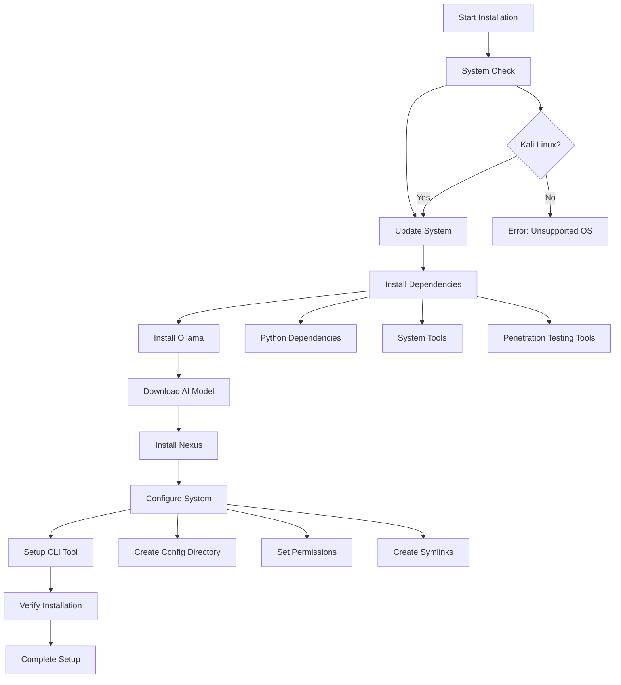

# Nexus Kali Linux Installation System

## Overview
The Kali Linux installation system provides automated setup of the Nexus AI-powered penetration testing tool, including all dependencies, AI model installation, and system configuration. This system ensures a seamless installation experience on Kali Linux with proper integration into the system.

## Installation Architecture

### Installation Flow



## Installation Scripts

### Main Installation Script (`install.sh`)

```bash
#!/bin/bash

# Nexus AI-Powered Penetration Testing Tool - Kali Linux Installer
# Version: 1.0.0
# Author: Nexus Development Team

set -e  # Exit on any error

# Colors for output
RED='\033[0;31m'
GREEN='\033[0;32m'
YELLOW='\033[1;33m'
BLUE='\033[0;34m'
NC='\033[0m' # No Color

# Configuration
NEXUS_VERSION="1.0.0"
OLLAMA_MODEL="huihui_ai/qwen2.5-coder-abliterate:14b"
NEXUS_HOME="$HOME/.nexus"
NEXUS_CONFIG_DIR="$NEXUS_HOME/config"
NEXUS_LOG_DIR="$NEXUS_HOME/logs"
NEXUS_REPORT_DIR="$NEXUS_HOME/reports"
NEXUS_DATA_DIR="$NEXUS_HOME/data"

# Logging
INSTALL_LOG="$HOME/nexus_install.log"

log() {
    echo -e "${GREEN}[$(date +'%Y-%m-%d %H:%M:%S')] $1${NC}" | tee -a "$INSTALL_LOG"
}

log_error() {
    echo -e "${RED}[$(date +'%Y-%m-%d %H:%M:%S')] ERROR: $1${NC}" | tee -a "$INSTALL_LOG"
}

log_warning() {
    echo -e "${YELLOW}[$(date +'%Y-%m-%d %H:%M:%S')] WARNING: $1${NC}" | tee -a "$INSTALL_LOG"
}

log_info() {
    echo -e "${BLUE}[$(date +'%Y-%m-%d %H:%M:%S')] INFO: $1${NC}" | tee -a "$INSTALL_LOG"
}

# Banner
show_banner() {
    echo -e "${GREEN}"
    cat << "EOF"
    ███╗   ██╗███████╗██╗  ██╗██╗   ██╗███████╗
    ████╗  ██║██╔════╝╚██╗██╔╝██║   ██║██╔════╝
    ██╔██╗ ██║█████╗   ╚███╔╝ ██║   ██║███████╗
    ██║╚██╗██║██╔══╝   ██╔██╗ ██║   ██║╚════██║
    ██║ ╚████║███████╗██╔╝ ██╗╚██████╔╝███████║
    ╚═╝  ╚═══╝╚══════╝╚═╝  ╚═╝ ╚═════╝ ╚══════╝
    
    AI-Powered Penetration Testing Automation Tool
    Version: 1.0.0
    
EOF
    echo -e "${NC}"
}

# System checks
check_system() {
    log "Performing system checks..."
    
    # Check if running on Kali Linux
    if ! grep -q "Kali" /etc/os-release 2>/dev/null; then
        log_error "This installer is designed for Kali Linux only"
        log_error "Current OS: $(cat /etc/os-release | grep PRETTY_NAME | cut -d'"' -f2)"
        exit 1
    fi
    
    # Check if running as root (not recommended)
    if [[ $EUID -eq 0 ]]; then
        log_warning "Running as root is not recommended"
        read -p "Continue anyway? (y/N): " -n 1 -r
        echo
        if [[ ! $REPLY =~ ^[Yy]$ ]]; then
            exit 1
        fi
    fi
    
    # Check available disk space (minimum 10GB)
    available_space=$(df / | awk 'NR==2 {print $4}')
    required_space=10485760  # 10GB in KB
    
    if [[ $available_space -lt $required_space ]]; then
        log_error "Insufficient disk space. Required: 10GB, Available: $((available_space/1024/1024))GB"
        exit 1
    fi
    
    # Check internet connectivity
    if ! ping -c 1 google.com &> /dev/null; then
        log_error "No internet connection detected"
        exit 1
    fi
    
    log "System checks passed"
}

# Update system
update_system() {
    log "Updating system packages..."
    
    sudo apt update -y >> "$INSTALL_LOG" 2>&1
    sudo apt upgrade -y >> "$INSTALL_LOG" 2>&1
    
    log "System updated successfully"
}

# Install system dependencies
install_dependencies() {
    log "Installing system dependencies..."
    
    # Essential packages
    local packages=(
        "python3"
        "python3-pip"
        "python3-venv"
        "git"
        "curl"
        "wget"
        "jq"
        "sqlite3"
        "build-essential"
        "libssl-dev"
        "libffi-dev"
        "python3-dev"
        "libxml2-dev"
        "libxslt1-dev"
        "zlib1g-dev"
    )
    
    for package in "${packages[@]}"; do
        log_info "Installing $package..."
        sudo apt install -y "$package" >> "$INSTALL_LOG" 2>&1
    done
    
    # Install penetration testing tools (if not already present)
    local pentest_tools=(
        "nmap"
        "gobuster"
        "nikto"
        "sqlmap"
        "hydra"
        "john"
        "metasploit-framework"
        "dirb"
        "dnsrecon"
        "theharvester"
        "sublist3r"
        "amass"
        "masscan"
        "whatweb"
        "wafw00f"
        "sslscan"
    )
    
    log "Installing penetration testing tools..."
    for tool in "${pentest_tools[@]}"; do
        if ! command -v "$tool" &> /dev/null; then
            log_info "Installing $tool..."
            sudo apt install -y "$tool" >> "$INSTALL_LOG" 2>&1
        else
            log_info "$tool already installed"
        fi
    done
    
    log "Dependencies installed successfully"
}

# Install Ollama
install_ollama() {
    log "Installing Ollama..."
    
    # Check if Ollama is already installed
    if command -v ollama &> /dev/null; then
        log_info "Ollama already installed"
        return 0
    fi
    
    # Download and install Ollama
    curl -fsSL https://ollama.ai/install.sh | sh >> "$INSTALL_LOG" 2>&1
    
    # Start Ollama service
    sudo systemctl enable ollama >> "$INSTALL_LOG" 2>&1
    sudo systemctl start ollama >> "$INSTALL_LOG" 2>&1
    
    # Wait for Ollama to start
    log_info "Waiting for Ollama service to start..."
    sleep 10
    
    # Verify Ollama installation
    if ! command -v ollama &> /dev/null; then
        log_error "Ollama installation failed"
        exit 1
    fi
    
    log "Ollama installed successfully"
}

# Download AI model
download_ai_model() {
    log "Downloading AI model: $OLLAMA_MODEL"
    log_warning "This may take a while depending on your internet connection..."
    
    # Pull the model
    ollama pull "$OLLAMA_MODEL" >> "$INSTALL_LOG" 2>&1
    
    # Verify model download
    if ! ollama list | grep -q "$(echo $OLLAMA_MODEL | cut -d'/' -f2)"; then
        log_error "Failed to download AI model"
        exit 1
    fi
    
    log "AI model downloaded successfully"
}

# Create directory structure
create_directories() {
    log "Creating Nexus directory structure..."
    
    # Create main directories
    mkdir -p "$NEXUS_HOME"
    mkdir -p "$NEXUS_CONFIG_DIR"
    mkdir -p "$NEXUS_LOG_DIR"
    mkdir -p "$NEXUS_REPORT_DIR"
    mkdir -p "$NEXUS_DATA_DIR"
    mkdir -p "$NEXUS_HOME/campaigns"
    mkdir -p "$NEXUS_HOME/templates"
    mkdir -p "$NEXUS_HOME/plugins"
    
    # Set proper permissions
    chmod 755 "$NEXUS_HOME"
    chmod 700 "$NEXUS_CONFIG_DIR"  # Sensitive configuration
    chmod 755 "$NEXUS_LOG_DIR"
    chmod 755 "$NEXUS_REPORT_DIR"
    chmod 700 "$NEXUS_DATA_DIR"    # Sensitive data
    
    log "Directory structure created"
}

# Install Nexus
install_nexus() {
    log "Installing Nexus..."
    
    # Create Python virtual environment
    python3 -m venv "$NEXUS_HOME/venv" >> "$INSTALL_LOG" 2>&1
    
    # Activate virtual environment
    source "$NEXUS_HOME/venv/bin/activate"
    
    # Upgrade pip
    pip install --upgrade pip >> "$INSTALL_LOG" 2>&1
    
    # Install Nexus (assuming it's in current directory)
    if [[ -f "setup.py" ]]; then
        pip install -e . >> "$INSTALL_LOG" 2>&1
    else
        log_error "setup.py not found. Please run installer from Nexus source directory"
        exit 1
    fi
    
    log "Nexus installed successfully"
}

# Create configuration files
create_configuration() {
    log "Creating configuration files..."
    
    # Main configuration file
    cat > "$NEXUS_CONFIG_DIR/config.yaml" << EOF
# Nexus Configuration File
# Generated on $(date)

ai:
  model: "$OLLAMA_MODEL"
  ollama_url: "http://localhost:11434"
  temperature: 0.7
  max_tokens: 2048
  timeout: 300

tools:
  nmap:
    path: "$(which nmap)"
    default_args: ["-sS", "-sV", "-O"]
    timeout: 600
  
  metasploit:
    path: "/usr/share/metasploit-framework"
    msfconsole: "/usr/bin/msfconsole"
    timeout: 900
  
  sqlmap:
    path: "$(which sqlmap)"
    timeout: 1800
  
  gobuster:
    path: "$(which gobuster)"
    wordlist: "/usr/share/wordlists/dirb/common.txt"
    timeout: 300
  
  nikto:
    path: "$(which nikto)"
    timeout: 600

safety:
  scope_validation: true
  rate_limiting: true
  max_concurrent_scans: 5
  confirmation_required: false
  emergency_contacts: []

logging:
  level: "INFO"
  file: "$NEXUS_LOG_DIR/nexus.log"
  format: "json"
  max_size: "100MB"
  backup_count: 5

reporting:
  output_dir: "$NEXUS_REPORT_DIR"
  formats: ["html", "json", "pdf"]
  template_dir: "$NEXUS_HOME/templates"

database:
  path: "$NEXUS_DATA_DIR/nexus.db"
  backup_interval: 3600  # 1 hour

plugins:
  directory: "$NEXUS_HOME/plugins"
  auto_load: true
EOF

    # Create default campaign template
    cat > "$NEXUS_HOME/templates/default_campaign.yaml" << EOF
# Default Campaign Template
campaign:
  name: "Default Assessment"
  description: "Standard penetration testing assessment"
  
  objectives:
    - "Network reconnaissance"
    - "Vulnerability identification"
    - "Exploitation attempts"
    - "Post-exploitation activities"
  
  scope:
    ip_ranges: []
    domains: []
    excluded_ips: []
    excluded_domains: []
    ports_allowed: []
    ports_excluded: [22, 3389]  # SSH, RDP typically excluded
  
  timeline:
    duration_hours: 24
    start_time: null
    end_time: null
  
  rules_of_engagement:
    - "Only test authorized targets"
    - "Avoid service disruption"
    - "Report critical findings immediately"
    - "Maintain evidence chain of custody"
EOF

    # Create logging configuration
    cat > "$NEXUS_CONFIG_DIR/logging.conf" << EOF
[loggers]
keys=root,nexus

[handlers]
keys=consoleHandler,fileHandler

[formatters]
keys=simpleFormatter,jsonFormatter

[logger_root]
level=INFO
handlers=consoleHandler

[logger_nexus]
level=INFO
handlers=consoleHandler,fileHandler
qualname=nexus
propagate=0

[handler_consoleHandler]
class=StreamHandler
level=INFO
formatter=simpleFormatter
args=(sys.stdout,)

[handler_fileHandler]
class=handlers.RotatingFileHandler
level=INFO
formatter=jsonFormatter
args=('$NEXUS_LOG_DIR/nexus.log', 'a', 104857600, 5)

[formatter_simpleFormatter]
format=%(asctime)s - %(name)s - %(levelname)s - %(message)s

[formatter_jsonFormatter]
format={"timestamp": "%(asctime)s", "logger": "%(name)s", "level": "%(levelname)s", "message": "%(message)s"}
EOF

    log "Configuration files created"
}

# Setup CLI tool
setup_cli() {
    log "Setting up CLI tool..."
    
    # Create nexus wrapper script
    cat > "$NEXUS_HOME/nexus" << EOF
#!/bin/bash
# Nexus CLI Wrapper Script

# Activate virtual environment
source "$NEXUS_HOME/venv/bin/activate"

# Set environment variables
export NEXUS_HOME="$NEXUS_HOME"
export NEXUS_CONFIG="$NEXUS_CONFIG_DIR/config.yaml"

# Run Nexus with all arguments
python -m nexus.cli.main "\$@"
EOF

    # Make script executable
    chmod +x "$NEXUS_HOME/nexus"
    
    # Create symlink in /usr/local/bin
    sudo ln -sf "$NEXUS_HOME/nexus" /usr/local/bin/nexus
    
    # Add to PATH if not already there
    if ! echo "$PATH" | grep -q "/usr/local/bin"; then
        echo 'export PATH="/usr/local/bin:$PATH"' >> "$HOME/.bashrc"
    fi
    
    log "CLI tool setup complete"
}

# Verify installation
verify_installation() {
    log "Verifying installation..."
    
    # Test Ollama
    if ! ollama list | grep -q "$(echo $OLLAMA_MODEL | cut -d'/' -f2)"; then
        log_error "AI model verification failed"
        return 1
    fi
    
    # Test Nexus CLI
    if ! command -v nexus &> /dev/null; then
        log_error "Nexus CLI not found in PATH"
        return 1
    fi
    
    # Test Nexus functionality
    if ! nexus --version &> /dev/null; then
        log_error "Nexus CLI test failed"
        return 1
    fi
    
    # Test configuration
    if [[ ! -f "$NEXUS_CONFIG_DIR/config.yaml" ]]; then
        log_error "Configuration file not found"
        return 1
    fi
    
    log "Installation verification passed"
    return 0
}

# Cleanup function
cleanup() {
    log "Cleaning up temporary files..."
    # Add cleanup logic here if needed
}

# Main installation function
main() {
    show_banner
    
    log "Starting Nexus installation on Kali Linux"
    log "Installation log: $INSTALL_LOG"
    
    # Trap cleanup on exit
    trap cleanup EXIT
    
    # Installation steps
    check_system
    update_system
    install_dependencies
    install_ollama
    download_ai_model
    create_directories
    install_nexus
    create_configuration
    setup_cli
    
    if verify_installation; then
        log "✅ Nexus installation completed successfully!"
        echo
        echo -e "${GREEN}🎉 Installation Complete! 🎉${NC}"
        echo
        echo -e "${BLUE}Next steps:${NC}"
        echo "1. Restart your terminal or run: source ~/.bashrc"
        echo "2. Test the installation: nexus --help"
        echo "3. Configure your first campaign: nexus campaign create"
        echo "4. Read the documentation: nexus docs"
        echo
        echo -e "${YELLOW}Important:${NC}"
        echo "- Always ensure you have proper authorization before testing"
        echo "- Review the configuration file: $NEXUS_CONFIG_DIR/config.yaml"
        echo "- Check logs at: $NEXUS_LOG_DIR/"
        echo
    else
        log_error "Installation verification failed"
        exit 1
    fi
}

# Run main function
main "$@"
```

### Ollama Setup Script (`scripts/setup_ollama.sh`)

```bash
#!/bin/bash

# Ollama Setup Script for Nexus
# This script handles Ollama installation and model management

set -e

# Colors
GREEN='\033[0;32m'
RED='\033[0;31m'
YELLOW='\033[1;33m'
NC='\033[0m'

log() {
    echo -e "${GREEN}[$(date +'%H:%M:%S')] $1${NC}"
}

log_error() {
    echo -e "${RED}[$(date +'%H:%M:%S')] ERROR: $1${NC}"
}

log_warning() {
    echo -e "${YELLOW}[$(date +'%H:%M:%S')] WARNING: $1${NC}"
}

# Check if Ollama is running
check_ollama_service() {
    if ! systemctl is-active --quiet ollama; then
        log "Starting Ollama service..."
        sudo systemctl start ollama
        sleep 5
    fi
    
    if ! curl -s http://localhost:11434/api/tags > /dev/null; then
        log_error "Ollama service is not responding"
        return 1
    fi
    
    log "Ollama service is running"
    return 0
}

# List available models
list_models() {
    log "Available models:"
    ollama list
}

# Pull a specific model
pull_model() {
    local model="$1"
    if [[ -z "$model" ]]; then
        log_error "Model name required"
        return 1
    fi
    
    log "Pulling model: $model"
    ollama pull "$model"
}

# Remove a model
remove_model() {
    local model="$1"
    if [[ -z "$model" ]]; then
        log_error "Model name required"
        return 1
    fi
    
    log "Removing model: $model"
    ollama rm "$model"
}

# Test model
test_model() {
    local model="$1"
    if [[ -z "$model" ]]; then
        model="huihui_ai/qwen2.5-coder-abliterate:14b"
    fi
    
    log "Testing model: $model"
    echo "You are a penetration testing assistant. Respond with 'Model test successful' if you can understand this message." | ollama run "$model"
}

# Show usage
usage() {
    echo "Usage: $0 [COMMAND] [OPTIONS]"
    echo
    echo "Commands:"
    echo "  install MODEL    Install/pull a specific model"
    echo "  remove MODEL     Remove a specific model"
    echo "  list            List installed models"
    echo "  test [MODEL]    Test a model (default: huihui_ai/qwen2.5-coder-abliterate:14b)"
    echo "  status          Check Ollama service status"
    echo "  restart         Restart Ollama service"
    echo
    echo "Examples:"
    echo "  $0 install huihui_ai/qwen2.5-coder-abliterate:14b"
    echo "  $0 test"
    echo "  $0 list"
}

# Main function
main() {
    case "${1:-}" in
        "install")
            check_ollama_service
            pull_model "$2"
            ;;
        "remove")
            remove_model "$2"
            ;;
        "list")
            list_models
            ;;
        "test")
            check_ollama_service
            test_model "$2"
            ;;
        "status")
            systemctl status ollama
            ;;
        "restart")
            sudo systemctl restart ollama
            log "Ollama service restarted"
            ;;
        "help"|"--help"|"-h")
            usage
            ;;
        *)
            log_error "Unknown command: ${1:-}"
            usage
            exit 1
            ;;
    esac
}

main "$@"
```

### Uninstall Script (`scripts/uninstall.sh`)

```bash
#!/bin/bash

# Nexus Uninstall Script
# Removes Nexus and optionally Ollama

set -e

RED='\033[0;31m'
GREEN='\033[0;32m'
YELLOW='\033[1;33m'
NC='\033[0m'

NEXUS_HOME="$HOME/.nexus"

log() {
    echo -e "${GREEN}[$(date +'%H:%M:%S')] $1${NC}"
}

log_warning() {
    echo -e "${YELLOW}[$(date +'%H:%M:%S')] WARNING: $1${NC}"
}

log_error() {
    echo -e "${RED}[$(date +'%H:%M:%S')] ERROR: $1${NC}"
}

confirm() {
    read -p "$1 (y/N): " -n 1 -r
    echo
    [[ $REPLY =~ ^[Yy]$ ]]
}

uninstall_nexus() {
    log "Uninstalling Nexus..."
    
    # Remove CLI symlink
    if [[ -L "/usr/local/bin/nexus" ]]; then
        sudo rm -f /usr/local/bin/nexus
        log "Removed CLI symlink"
    fi
    
    # Remove Nexus home directory
    if [[ -d "$NEXUS_HOME" ]]; then
        if confirm "Remove Nexus data directory ($NEXUS_HOME)?"; then
            rm -rf "$NEXUS_HOME"
            log "Removed Nexus data directory"
        else
            log_warning "Nexus data directory preserved"
        fi
    fi
    
    log "Nexus uninstalled"
}

uninstall_ollama() {
    if confirm "Remove Ollama and all models?"; then
        log "Uninstalling Ollama..."
        
        # Stop service
        sudo systemctl stop ollama 2>/dev/null || true
        sudo systemctl disable ollama 2>/dev/null || true
        
        # Remove Ollama binary
        sudo rm -f /usr/local/bin/ollama
        
        # Remove Ollama data
        sudo rm -rf /usr/share/ollama
        rm -rf "$HOME/.ollama"
        
        # Remove systemd service
        sudo rm -f /etc/systemd/system/ollama.service
        sudo systemctl daemon-reload
        
        log "Ollama uninstalled"
    else
        log_warning "Ollama preserved"
    fi
}

main() {
    echo -e "${RED}"
    cat << "EOF"
    ╔══════════════════════════════════════╗
    ║           NEXUS UNINSTALLER          ║
    ╚══════════════════════════════════════╝
EOF
    echo -e "${NC}"
    
    log_warning "This will remove Nexus from your system"
    
    if ! confirm "Continue with uninstallation?"; then
        log "Uninstallation cancelled"
        exit 0
    fi
    
    uninstall_nexus
    uninstall_ollama
    
    log "✅ Uninstallation complete"
}

main "$@"
```

### Update Script (`scripts/update.sh`)

```bash
#!/bin/bash

# Nexus Update Script
# Updates Nexus and optionally the AI model

set -e

GREEN='\033[0;32m'
BLUE='\033[0;34m'
YELLOW='\033[1;33m'
NC='\033[0m'

NEXUS_HOME="$HOME/.nexus"

log() {
    echo -e "${GREEN}[$(date +'%H:%M:%S')] $1${NC}"
}

log_info() {
    echo -e "${BLUE}[$(date +'%H:%M:%S')] $1${NC}"
}

log_warning() {
    echo -e "${YELLOW}[$(date +'%H:%M:%S')] $1${NC}"
}

update_nexus() {
    log "Updating Nexus..."
    
    # Activate virtual environment
    source "$NEXUS_HOME/venv/bin/activate"
    
    # Update from git (if in development)
    if [[ -d ".git" ]]; then
        git pull origin main
        pip install -e . --upgrade
    else
        # Update from PyPI (when available)
        pip install --upgrade nexus-pentest
    fi
    
    log "Nexus updated successfully"
}

update_model() {
    local model="${1:-huihui_ai/qwen2.5-coder-abliterate:14b}"
    
    log "Updating AI model: $model"
    ollama pull "$model"
    log "AI model updated successfully"
}

backup_config() {
    log "Creating configuration backup..."
    
    local backup_dir="$NEXUS_HOME/backups/$(date +%Y%m%d_%H%M%S)"
    mkdir -p "$backup_dir"
    
    cp -r "$NEXUS_HOME/config" "$backup_dir/"
    cp -r "$NEXUS_HOME/campaigns" "$backup_dir/" 2>/dev/null || true
    
    log "Configuration backed up to: $backup_dir"
}

main() {
    log_info "Nexus Update Manager"
    
    backup_config
    update_nexus
    
    if [[ "${1:-}" == "--update-model" ]]; then
        update_model "$2"
    fi
    
    log "✅ Update complete"
    log_warning "Restart any running Nexus processes to use the updated version"
}

main "$@"
```

This comprehensive installation system provides automated setup of Nexus on Kali Linux with proper dependency management, configuration, and system integration.