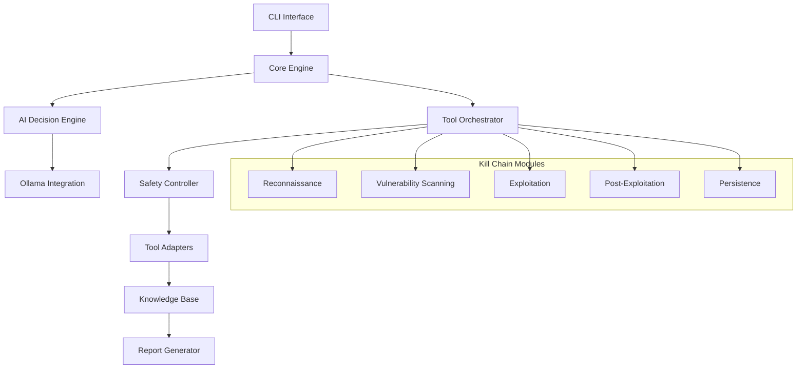

# Nexus AI-Powered Penetration Testing Tool - Complete Implementation Plan

## Executive Summary

Nexus is a comprehensive AI-powered penetration testing automation tool designed for professional red team assessments and authorized penetration testing engagements. It leverages the Qwen3-14B-abliterated model via Ollama to automate the entire kill chain from reconnaissance through persistence, providing intelligent decision-making and tool orchestration throughout the assessment process.

## Project Overview

### Key Features
- **Full Kill Chain Automation**: Covers reconnaissance, scanning, exploitation, and persistence
- **AI-Driven Decision Making**: Uses advanced AI prompts to make strategic decisions
- **Intelligent Tool Chaining**: Automatically uses outputs from one tool as inputs to another
- **Comprehensive Safety Mechanisms**: Multi-layer safety and scope validation
- **Professional Reporting**: Automated evidence collection and report generation
- **Kali Linux Integration**: Native installation and integration with Kali Linux tools

### Target Use Cases
- Professional red team assessments
- Authorized penetration testing engagements
- Security assessment automation
- Vulnerability research and testing

## Architecture Overview

### Core Components



## Implementation Roadmap

### Phase 1: Foundation (Weeks 1-4)
**Status: Architecture Complete ✅**

#### Completed Components:
1. **Core Architecture Design** ✅
   - System architecture and component relationships
   - Data flow and integration patterns
   - Scalability and extensibility considerations

2. **AI Prompt Engineering System** ✅
   - Phase-specific prompt templates
   - Dynamic context building
   - Response parsing and validation
   - Adaptive learning framework

3. **Tool Integration Framework** ✅
   - Base tool adapter architecture
   - Specific adapters for major tools (Nmap, Metasploit, SQLMap)
   - Intelligent tool selection algorithms
   - Data transformation pipelines

4. **Safety and Scope Validation** ✅
   - Multi-layer safety framework
   - Scope validation system
   - Rate limiting and emergency controls
   - Compliance monitoring

5. **Installation System** ✅
   - Automated Kali Linux installation
   - Ollama and model setup
   - System configuration and CLI integration

### Phase 2: Core Implementation (Weeks 5-8)

#### 2.1 Project Structure and Foundation
```
nexus/
├── nexus/
│   ├── __init__.py
│   ├── core/
│   │   ├── engine.py              # Main orchestration engine
│   │   ├── ai_decision.py         # AI decision making
│   │   ├── state_manager.py       # Campaign state management
│   │   └── config.py              # Configuration management
│   ├── ai/
│   │   ├── ollama_client.py       # Ollama integration
│   │   ├── prompt_templates.py    # AI prompt templates
│   │   ├── response_parser.py     # Response parsing
│   │   └── context_builder.py     # Context building
│   ├── safety/
│   │   ├── scope_validator.py     # Scope validation
│   │   ├── rate_limiter.py        # Rate limiting
│   │   └── safety_checks.py       # Safety mechanisms
│   └── cli/
│       ├── main.py                # CLI entry point
│       └── commands.py            # CLI commands
├── config/
│   ├── default.yaml               # Default configuration
│   └── prompts/                   # AI prompt templates
├── scripts/
│   ├── install.sh                 # Installation script
│   └── setup_ollama.sh            # Ollama setup
└── tests/
    ├── unit/
    ├── integration/
    └── fixtures/
```

#### 2.2 Core Engine Implementation
- **Main Orchestration Engine**: Central coordinator for all operations
- **AI Decision Engine**: Integration with Ollama for intelligent decision making
- **State Management**: Campaign state tracking and persistence
- **Configuration System**: Flexible configuration management

#### 2.3 Ollama Integration
- **Client Implementation**: HTTP client for Ollama API
- **Model Management**: Loading, switching, and managing AI models
- **Prompt Processing**: Template rendering and context injection
- **Response Handling**: Parsing and validation of AI responses

### Phase 3: Kill Chain Modules (Weeks 9-16)

#### 3.1 Reconnaissance Module (Weeks 9-10)
**Passive Reconnaissance:**
- OSINT gathering (theHarvester, Shodan API)
- DNS enumeration (dnsrecon, fierce)
- Subdomain discovery (Sublist3r, Amass)
- Social media and public information gathering

**Active Reconnaissance:**
- Port scanning (Nmap with intelligent parameter selection)
- Service detection and banner grabbing
- Web crawling and directory enumeration
- SSL/TLS certificate analysis

#### 3.2 Vulnerability Scanning Engine (Weeks 11-12)
**Network Scanning:**
- Comprehensive port scans with timing optimization
- Service version detection and OS fingerprinting
- Vulnerability scanning integration

**Web Application Testing:**
- Automated web app scanning (Nikto, OWASP ZAP)
- SQL injection testing (SQLMap)
- XSS and other web vulnerability detection

#### 3.3 Exploitation Framework (Weeks 13-14)
**Vulnerability Assessment:**
- CVE database correlation
- Exploit availability checking
- Custom exploit generation

**Exploitation Execution:**
- Metasploit integration for automated exploitation
- Custom payload generation and delivery
- Web application exploit automation

#### 3.4 Post-Exploitation and Persistence (Weeks 15-16)
**Post-Exploitation:**
- Shell stabilization and upgrade
- System information gathering
- Privilege escalation automation

**Persistence Mechanisms:**
- Backdoor installation
- Registry/cron job persistence
- Service creation and modification

### Phase 4: Advanced Features (Weeks 17-20)

#### 4.1 Logging and Reporting System
- **Evidence Collection**: Comprehensive logging of all activities
- **Report Generation**: Automated report creation in multiple formats
- **Chain of Custody**: Maintaining evidence integrity
- **Compliance Reporting**: Meeting regulatory requirements

#### 4.2 CLI and User Interface
- **Command-Line Interface**: Comprehensive CLI with subcommands
- **Configuration Management**: Easy configuration editing and validation
- **Campaign Management**: Create, manage, and track campaigns
- **Real-time Status**: Live updates on campaign progress

#### 4.3 Testing and Validation
- **Unit Tests**: Comprehensive test coverage for all components
- **Integration Tests**: End-to-end testing of tool chains
- **Safety Tests**: Validation of safety mechanisms
- **Performance Tests**: Load and performance testing

### Phase 5: Documentation and Deployment (Weeks 21-24)

#### 5.1 Documentation
- **Installation Guide**: Step-by-step installation instructions
- **User Manual**: Comprehensive usage documentation
- **API Documentation**: Developer documentation for extensions
- **Best Practices**: Guidelines for effective use

#### 5.2 Deployment and Distribution
- **Package Creation**: Python package for distribution
- **Docker Containers**: Containerized deployment options
- **CI/CD Pipeline**: Automated testing and deployment
- **Release Management**: Version control and release process

## Technical Specifications

### System Requirements
- **Operating System**: Kali Linux (primary), Ubuntu/Debian (secondary)
- **Python Version**: 3.9+
- **Memory**: Minimum 8GB RAM (16GB recommended for AI model)
- **Storage**: 20GB free space (for AI model and data)
- **Network**: Internet connection for model downloads and updates

### Dependencies
- **Core**: Python 3.9+, SQLite, asyncio
- **AI**: Ollama, Qwen3-14B-abliterated model
- **Tools**: Nmap, Metasploit, SQLMap, Gobuster, Nikto, Hydra, John
- **Libraries**: requests, pyyaml, click, jinja2, sqlalchemy

### Performance Targets
- **Startup Time**: < 5 seconds
- **AI Response Time**: < 30 seconds per decision
- **Tool Execution**: Parallel execution of up to 5 tools
- **Memory Usage**: < 4GB during normal operation
- **Report Generation**: < 60 seconds for standard reports

## Security Considerations

### Safety Mechanisms
1. **Scope Validation**: Multi-layer validation of target scope
2. **Rate Limiting**: Configurable rate limits to avoid detection
3. **Emergency Controls**: Kill switch and emergency stop functionality
4. **Audit Logging**: Comprehensive logging of all activities
5. **Access Control**: User authentication and authorization

### Ethical Guidelines
1. **Authorization Required**: Only operate on authorized targets
2. **Scope Compliance**: Strict adherence to defined scope
3. **Evidence Handling**: Proper chain of custody for evidence
4. **Responsible Disclosure**: Guidelines for vulnerability reporting
5. **Legal Compliance**: Adherence to applicable laws and regulations

## Usage Examples

### Basic Campaign Execution
```bash
# Create a new campaign
nexus campaign create --name "Web App Assessment" --target "example.com"

# Configure scope
nexus campaign scope add --ip-range "192.168.1.0/24" --domain "*.example.com"

# Run automated assessment
nexus run --campaign "Web App Assessment" --prompt "Perform comprehensive web application penetration test focusing on OWASP Top 10"

# Monitor progress
nexus status --campaign "Web App Assessment"

# Generate report
nexus report --campaign "Web App Assessment" --format html --output report.html
```

### Advanced Configuration
```bash
# Configure AI model
nexus config set ai.model "custom-model"
nexus config set ai.ollama_url "http://remote-server:11434"

# Configure tool parameters
nexus config set tools.nmap.timing 2
nexus config set safety.rate_limiting true

# View current configuration
nexus config show
```

### Tool Chain Examples
```bash
# Custom tool chain
nexus chain create --name "web-discovery" \
  --step "nmap -sS -p80,443,8080,8443 {target}" \
  --step "gobuster dir -u http://{target} -w /usr/share/wordlists/dirb/common.txt" \
  --step "nikto -h {target}"

# Execute tool chain
nexus chain run --name "web-discovery" --target "example.com"
```

## Quality Assurance

### Testing Strategy
1. **Unit Testing**: 90%+ code coverage
2. **Integration Testing**: End-to-end workflow testing
3. **Security Testing**: Safety mechanism validation
4. **Performance Testing**: Load and stress testing
5. **User Acceptance Testing**: Real-world scenario testing

### Code Quality
1. **Code Standards**: PEP 8 compliance
2. **Documentation**: Comprehensive docstrings
3. **Type Hints**: Full type annotation
4. **Linting**: Automated code quality checks
5. **Security Scanning**: Static analysis for vulnerabilities

## Risk Assessment

### Technical Risks
1. **AI Model Reliability**: Mitigation through validation and fallbacks
2. **Tool Integration**: Comprehensive testing and error handling
3. **Performance Issues**: Optimization and resource management
4. **Security Vulnerabilities**: Regular security audits

### Operational Risks
1. **Misuse**: Strong safety mechanisms and user education
2. **Legal Issues**: Clear usage guidelines and authorization requirements
3. **Detection**: Stealth features and rate limiting
4. **Data Breach**: Encryption and secure storage

## Success Metrics

### Technical Metrics
- **Reliability**: 99%+ uptime during assessments
- **Accuracy**: 95%+ accuracy in vulnerability detection
- **Performance**: Sub-30 second AI decision times
- **Coverage**: Support for 50+ penetration testing tools

### User Metrics
- **Adoption**: Target 1000+ professional users in first year
- **Satisfaction**: 4.5+ star rating from users
- **Efficiency**: 70%+ reduction in manual testing time
- **Effectiveness**: 90%+ of vulnerabilities found automatically

## Conclusion

The Nexus AI-powered penetration testing tool represents a significant advancement in automated security testing. By combining advanced AI decision-making with comprehensive tool integration and robust safety mechanisms, Nexus provides professional penetration testers with a powerful platform for conducting thorough and efficient security assessments.

The implementation plan outlined above provides a clear roadmap for developing Nexus from concept to production-ready tool. With proper execution, Nexus will become an essential tool for cybersecurity professionals conducting authorized penetration testing engagements.

## Next Steps

1. **Review and Approve Architecture**: Stakeholder review of technical architecture
2. **Resource Allocation**: Assign development team and resources
3. **Development Environment Setup**: Establish development infrastructure
4. **Phase 1 Implementation**: Begin core component development
5. **Continuous Testing**: Implement testing throughout development process

The foundation has been laid with comprehensive architectural documentation. The next phase involves transitioning from planning to implementation, beginning with the core engine and AI integration components.