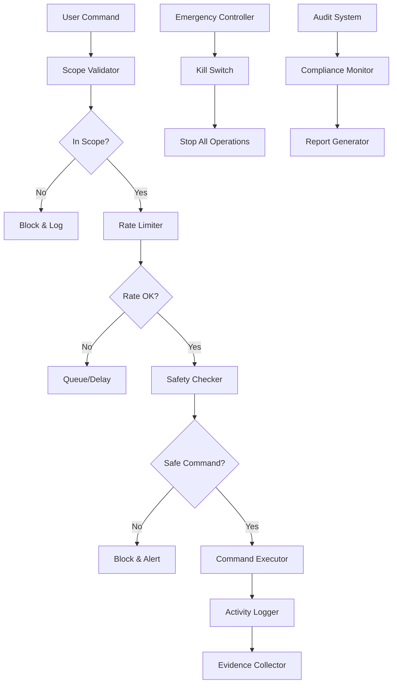

# Nexus Safety Mechanisms and Scope Validation System

## Overview
The safety and scope validation system is a critical component that ensures Nexus operates only within authorized boundaries, maintains ethical standards, and provides comprehensive safeguards against misuse. This system implements multiple layers of protection including scope validation, rate limiting, emergency controls, and comprehensive audit logging.

## Safety Architecture

### Multi-Layer Safety Framework



### Core Safety Components

```python
from typing import List, Dict, Set, Optional, Tuple
import ipaddress
import re
import time
import threading
from datetime import datetime, timedelta
from dataclasses import dataclass
from enum import Enum
import json
import logging

class SafetyLevel(Enum):
    LOW = "low"
    MEDIUM = "medium"
    HIGH = "high"
    CRITICAL = "critical"

class ActionType(Enum):
    RECONNAISSANCE = "reconnaissance"
    SCANNING = "scanning"
    EXPLOITATION = "exploitation"
    POST_EXPLOITATION = "post_exploitation"
    PERSISTENCE = "persistence"

@dataclass
class ScopeDefinition:
    ip_ranges: List[str]
    domains: List[str]
    excluded_ips: List[str]
    excluded_domains: List[str]
    ports_allowed: List[int]
    ports_excluded: List[int]
    time_window: Tuple[datetime, datetime]
    authorized_by: str
    authorization_document: str

@dataclass
class SafetyViolation:
    violation_type: str
    severity: SafetyLevel
    description: str
    command: str
    target: str
    timestamp: datetime
    user: str
    blocked: bool

class ScopeValidator:
    def __init__(self, scope_definition: ScopeDefinition):
        self.scope = scope_definition
        self.violations = []
        self.logger = logging.getLogger("nexus.safety.scope")
    
    def validate_target(self, target: str, port: Optional[int] = None) -> Tuple[bool, str]:
        """Validate if target is within authorized scope"""
        
        # Check time window
        current_time = datetime.now()
        if not (self.scope.time_window[0] <= current_time <= self.scope.time_window[1]):
            return False, f"Current time {current_time} is outside authorized window"
        
        # Validate IP addresses
        if self._is_ip_address(target):
            return self._validate_ip(target, port)
        
        # Validate domains
        if self._is_domain(target):
            return self._validate_domain(target, port)
        
        return False, f"Target {target} is not a valid IP address or domain"
    
    def _validate_ip(self, ip: str, port: Optional[int] = None) -> Tuple[bool, str]:
        """Validate IP address against scope"""
        try:
            target_ip = ipaddress.ip_address(ip)
            
            # Check excluded IPs first
            for excluded_ip in self.scope.excluded_ips:
                if target_ip == ipaddress.ip_address(excluded_ip):
                    return False, f"IP {ip} is explicitly excluded from scope"
            
            # Check if IP is in allowed ranges
            in_scope = False
            for ip_range in self.scope.ip_ranges:
                if "/" in ip_range:
                    # CIDR notation
                    network = ipaddress.ip_network(ip_range, strict=False)
                    if target_ip in network:
                        in_scope = True
                        break
                else:
                    # Single IP
                    if target_ip == ipaddress.ip_address(ip_range):
                        in_scope = True
                        break
            
            if not in_scope:
                return False, f"IP {ip} is not in authorized scope"
            
            # Validate port if specified
            if port is not None:
                return self._validate_port(port)
            
            return True, "IP is within authorized scope"
            
        except ValueError as e:
            return False, f"Invalid IP address: {e}"
    
    def _validate_domain(self, domain: str, port: Optional[int] = None) -> Tuple[bool, str]:
        """Validate domain against scope"""
        
        # Check excluded domains first
        for excluded_domain in self.scope.excluded_domains:
            if domain == excluded_domain or domain.endswith(f".{excluded_domain}"):
                return False, f"Domain {domain} is explicitly excluded from scope"
        
        # Check if domain is in allowed list
        in_scope = False
        for allowed_domain in self.scope.domains:
            if allowed_domain.startswith("*."):
                # Wildcard domain
                base_domain = allowed_domain[2:]
                if domain == base_domain or domain.endswith(f".{base_domain}"):
                    in_scope = True
                    break
            else:
                # Exact domain match
                if domain == allowed_domain:
                    in_scope = True
                    break
        
        if not in_scope:
            return False, f"Domain {domain} is not in authorized scope"
        
        # Validate port if specified
        if port is not None:
            return self._validate_port(port)
        
        return True, "Domain is within authorized scope"
    
    def _validate_port(self, port: int) -> Tuple[bool, str]:
        """Validate port against scope"""
        
        # Check excluded ports first
        if port in self.scope.ports_excluded:
            return False, f"Port {port} is explicitly excluded from scope"
        
        # Check allowed ports (if specified)
        if self.scope.ports_allowed:
            if port not in self.scope.ports_allowed:
                return False, f"Port {port} is not in allowed ports list"
        
        return True, f"Port {port} is allowed"
    
    def _is_ip_address(self, target: str) -> bool:
        """Check if target is an IP address"""
        try:
            ipaddress.ip_address(target)
            return True
        except ValueError:
            return False
    
    def _is_domain(self, target: str) -> bool:
        """Check if target is a domain name"""
        domain_pattern = r'^[a-zA-Z0-9]([a-zA-Z0-9\-]{0,61}[a-zA-Z0-9])?(\.[a-zA-Z0-9]([a-zA-Z0-9\-]{0,61}[a-zA-Z0-9])?)*$'
        return bool(re.match(domain_pattern, target))
    
    def log_violation(self, violation: SafetyViolation):
        """Log safety violation"""
        self.violations.append(violation)
        self.logger.warning(f"Safety violation: {violation.description}")

class RateLimiter:
    def __init__(self, max_requests_per_minute: int = 60, max_concurrent: int = 5):
        self.max_requests_per_minute = max_requests_per_minute
        self.max_concurrent = max_concurrent
        self.request_times = []
        self.active_requests = 0
        self.lock = threading.Lock()
        self.logger = logging.getLogger("nexus.safety.ratelimit")
    
    def can_proceed(self, action_type: ActionType) -> Tuple[bool, str]:
        """Check if action can proceed based on rate limits"""
        with self.lock:
            current_time = time.time()
            
            # Clean old request times (older than 1 minute)
            self.request_times = [t for t in self.request_times if current_time - t < 60]
            
            # Check requests per minute limit
            if len(self.request_times) >= self.max_requests_per_minute:
                return False, f"Rate limit exceeded: {len(self.request_times)} requests in last minute"
            
            # Check concurrent requests limit
            if self.active_requests >= self.max_concurrent:
                return False, f"Concurrent limit exceeded: {self.active_requests} active requests"
            
            # Apply action-specific limits
            action_limits = {
                ActionType.EXPLOITATION: 10,  # Max 10 exploitation attempts per minute
                ActionType.POST_EXPLOITATION: 5,  # Max 5 post-exploitation actions per minute
                ActionType.PERSISTENCE: 2  # Max 2 persistence actions per minute
            }
            
            if action_type in action_limits:
                action_count = sum(1 for t in self.request_times 
                                 if hasattr(t, 'action_type') and t.action_type == action_type)
                if action_count >= action_limits[action_type]:
                    return False, f"Action-specific rate limit exceeded for {action_type.value}"
            
            return True, "Rate limit check passed"
    
    def record_request(self, action_type: ActionType):
        """Record a new request"""
        with self.lock:
            request_time = time.time()
            request_time.action_type = action_type  # Add action type for tracking
            self.request_times.append(request_time)
            self.active_requests += 1
    
    def complete_request(self):
        """Mark request as completed"""
        with self.lock:
            self.active_requests = max(0, self.active_requests - 1)

class SafetyChecker:
    def __init__(self):
        self.dangerous_commands = self._load_dangerous_commands()
        self.suspicious_patterns = self._load_suspicious_patterns()
        self.logger = logging.getLogger("nexus.safety.checker")
    
    def _load_dangerous_commands(self) -> Set[str]:
        """Load list of dangerous commands that should be blocked"""
        return {
            # System destruction commands
            "rm -rf /", "del /s /q", "format", "mkfs", "dd if=/dev/zero",
            
            # Network disruption
            "shutdown", "reboot", "halt", "poweroff",
            
            # Malware-like behavior
            "wget http://", "curl http://", "nc -l", "python -m http.server",
            
            # Credential theft (outside authorized scope)
            "mimikatz", "hashdump", "sam", "shadow",
            
            # Lateral movement (requires explicit authorization)
            "psexec", "wmiexec", "smbexec",
            
            # Data destruction
            "shred", "wipe", "cipher /w"
        }
    
    def _load_suspicious_patterns(self) -> List[str]:
        """Load regex patterns for suspicious commands"""
        return [
            r'rm\s+-rf\s+/',
            r'del\s+/[sq]\s+',
            r'format\s+[a-z]:',
            r'dd\s+if=/dev/(zero|random)',
            r'wget\s+http://\d+\.\d+\.\d+\.\d+',
            r'curl\s+-[sS]\s+http://\d+\.\d+\.\d+\.\d+',
            r'nc\s+-[lL]\s+\d+',
            r'python\s+-m\s+http\.server',
            r'mimikatz\.exe',
            r'hashdump\s+',
            r'reg\s+save\s+HKLM\\SAM',
            r'cat\s+/etc/shadow',
            r'psexec\s+\\\\',
            r'wmiexec\.py',
            r'smbexec\.py'
        ]
    
    def check_command_safety(self, command: str, target: str, action_type: ActionType) -> Tuple[bool, str, SafetyLevel]:
        """Check if command is safe to execute"""
        
        # Check for explicitly dangerous commands
        command_lower = command.lower()
        for dangerous_cmd in self.dangerous_commands:
            if dangerous_cmd in command_lower:
                return False, f"Dangerous command detected: {dangerous_cmd}", SafetyLevel.CRITICAL
        
        # Check suspicious patterns
        for pattern in self.suspicious_patterns:
            if re.search(pattern, command, re.IGNORECASE):
                return False, f"Suspicious pattern detected: {pattern}", SafetyLevel.HIGH
        
        # Action-specific safety checks
        safety_result = self._check_action_specific_safety(command, target, action_type)
        if not safety_result[0]:
            return safety_result
        
        # Check for potential data exfiltration
        if self._is_data_exfiltration_command(command):
            return False, "Potential data exfiltration command detected", SafetyLevel.HIGH
        
        # Check for privilege escalation without authorization
        if self._is_privilege_escalation_command(command) and action_type != ActionType.POST_EXPLOITATION:
            return False, "Privilege escalation command outside authorized phase", SafetyLevel.MEDIUM
        
        return True, "Command passed safety checks", SafetyLevel.LOW
    
    def _check_action_specific_safety(self, command: str, target: str, action_type: ActionType) -> Tuple[bool, str, SafetyLevel]:
        """Perform action-specific safety checks"""
        
        if action_type == ActionType.RECONNAISSANCE:
            # Reconnaissance should be non-intrusive
            intrusive_patterns = [r'-A\s', r'--script.*exploit', r'-sU.*-sS']
            for pattern in intrusive_patterns:
                if re.search(pattern, command):
                    return False, f"Intrusive reconnaissance command: {pattern}", SafetyLevel.MEDIUM
        
        elif action_type == ActionType.EXPLOITATION:
            # Exploitation should target specific vulnerabilities
            if "exploit" not in command.lower() and "payload" not in command.lower():
                return False, "Exploitation command without clear exploit/payload", SafetyLevel.MEDIUM
        
        elif action_type == ActionType.PERSISTENCE:
            # Persistence mechanisms should be reversible
            irreversible_patterns = [r'reg\s+add.*\\Run', r'crontab\s+-e', r'systemctl\s+enable']
            for pattern in irreversible_patterns:
                if re.search(pattern, command):
                    return False, f"Potentially irreversible persistence: {pattern}", SafetyLevel.HIGH
        
        return True, "Action-specific safety check passed", SafetyLevel.LOW
    
    def _is_data_exfiltration_command(self, command: str) -> bool:
        """Check if command might be used for data exfiltration"""
        exfiltration_patterns = [
            r'scp\s+.*@',
            r'rsync\s+.*@',
            r'curl\s+-X\s+POST.*--data',
            r'wget\s+--post-data',
            r'nc\s+.*<.*',
            r'base64.*\|.*curl',
            r'tar\s+.*\|.*ssh'
        ]
        
        for pattern in exfiltration_patterns:
            if re.search(pattern, command, re.IGNORECASE):
                return True
        
        return False
    
    def _is_privilege_escalation_command(self, command: str) -> bool:
        """Check if command is for privilege escalation"""
        privesc_patterns = [
            r'sudo\s+',
            r'su\s+-',
            r'runas\s+',
            r'exploit.*privesc',
            r'linpeas',
            r'winpeas',
            r'linux-exploit-suggester',
            r'windows-exploit-suggester'
        ]
        
        for pattern in privesc_patterns:
            if re.search(pattern, command, re.IGNORECASE):
                return True
        
        return False

class EmergencyController:
    def __init__(self):
        self.kill_switch_active = False
        self.emergency_contacts = []
        self.active_processes = []
        self.logger = logging.getLogger("nexus.safety.emergency")
        self.lock = threading.Lock()
    
    def activate_kill_switch(self, reason: str, activated_by: str):
        """Activate emergency kill switch"""
        with self.lock:
            if self.kill_switch_active:
                return
            
            self.kill_switch_active = True
            self.logger.critical(f"KILL SWITCH ACTIVATED: {reason} by {activated_by}")
            
            # Stop all active processes
            self._stop_all_processes()
            
            # Send emergency notifications
            self._send_emergency_notifications(reason, activated_by)
            
            # Create emergency report
            self._create_emergency_report(reason, activated_by)
    
    def _stop_all_processes(self):
        """Stop all active Nexus processes"""
        for process in self.active_processes:
            try:
                process.terminate()
                self.logger.info(f"Terminated process: {process.pid}")
            except Exception as e:
                self.logger.error(f"Failed to terminate process {process.pid}: {e}")
        
        self.active_processes.clear()
    
    def _send_emergency_notifications(self, reason: str, activated_by: str):
        """Send emergency notifications to contacts"""
        message = f"NEXUS EMERGENCY: Kill switch activated. Reason: {reason}. Activated by: {activated_by}. Time: {datetime.now()}"
        
        for contact in self.emergency_contacts:
            try:
                # Implementation would depend on notification method (email, SMS, etc.)
                self.logger.info(f"Emergency notification sent to {contact}")
            except Exception as e:
                self.logger.error(f"Failed to send emergency notification to {contact}: {e}")
    
    def _create_emergency_report(self, reason: str, activated_by: str):
        """Create emergency incident report"""
        report = {
            "incident_type": "emergency_kill_switch",
            "timestamp": datetime.now().isoformat(),
            "reason": reason,
            "activated_by": activated_by,
            "active_processes_terminated": len(self.active_processes),
            "system_state": "emergency_shutdown"
        }
        
        # Save emergency report
        with open(f"emergency_report_{int(time.time())}.json", "w") as f:
            json.dump(report, f, indent=2)
    
    def deactivate_kill_switch(self, authorized_by: str):
        """Deactivate kill switch (requires authorization)"""
        with self.lock:
            if not self.kill_switch_active:
                return
            
            self.kill_switch_active = False
            self.logger.info(f"Kill switch deactivated by {authorized_by}")
    
    def is_kill_switch_active(self) -> bool:
        """Check if kill switch is currently active"""
        return self.kill_switch_active

class ComplianceMonitor:
    def __init__(self, scope_definition: ScopeDefinition):
        self.scope = scope_definition
        self.compliance_log = []
        self.logger = logging.getLogger("nexus.safety.compliance")
    
    def log_activity(self, activity: Dict[str, Any]):
        """Log activity for compliance monitoring"""
        compliance_entry = {
            "timestamp": datetime.now().isoformat(),
            "activity": activity,
            "scope_validation": self._validate_compliance(activity),
            "authorization_reference": self.scope.authorization_document
        }
        
        self.compliance_log.append(compliance_entry)
        self.logger.info(f"Compliance log entry: {compliance_entry}")
    
    def _validate_compliance(self, activity: Dict[str, Any]) -> Dict[str, Any]:
        """Validate activity against compliance requirements"""
        return {
            "within_scope": True,  # Would be determined by actual validation
            "within_time_window": True,
            "authorized_action": True,
            "proper_documentation": True
        }
    
    def generate_compliance_report(self) -> Dict[str, Any]:
        """Generate compliance report"""
        return {
            "report_generated": datetime.now().isoformat(),
            "scope_definition": {
                "ip_ranges": self.scope.ip_ranges,
                "domains": self.scope.domains,
                "time_window": [
                    self.scope.time_window[0].isoformat(),
                    self.scope.time_window[1].isoformat()
                ],
                "authorized_by": self.scope.authorized_by,
                "authorization_document": self.scope.authorization_document
            },
            "total_activities": len(self.compliance_log),
            "compliance_violations": [
                entry for entry in self.compliance_log
                if not all(entry["scope_validation"].values())
            ],
            "activities_by_type": self._categorize_activities()
        }
    
    def _categorize_activities(self) -> Dict[str, int]:
        """Categorize activities by type"""
        categories = {}
        for entry in self.compliance_log:
            activity_type = entry["activity"].get("type", "unknown")
            categories[activity_type] = categories.get(activity_type, 0) + 1
        return categories

class SafetyOrchestrator:
    def __init__(self, scope_definition: ScopeDefinition):
        self.scope_validator = ScopeValidator(scope_definition)
        self.rate_limiter = RateLimiter()
        self.safety_checker = SafetyChecker()
        self.emergency_controller = EmergencyController()
        self.compliance_monitor = ComplianceMonitor(scope_definition)
        self.logger = logging.getLogger("nexus.safety.orchestrator")
    
    def validate_and_authorize_action(self, command: str, target: str, action_type: ActionType, user: str) -> Tuple[bool, str]:
        """Comprehensive validation and authorization of actions"""
        
        # Check if kill switch is active
        if self.emergency_controller.is_kill_switch_active():
            return False, "Emergency kill switch is active - all operations suspended"
        
        # Validate scope
        scope_valid, scope_message = self.scope_validator.validate_target(target)
        if not scope_valid:
            violation = SafetyViolation(
                violation_type="scope_violation",
                severity=SafetyLevel.HIGH,
                description=scope_message,
                command=command,
                target=target,
                timestamp=datetime.now(),
                user=user,
                blocked=True
            )
            self.scope_validator.log_violation(violation)
            return False, f"Scope validation failed: {scope_message}"
        
        # Check rate limits
        rate_ok, rate_message = self.rate_limiter.can_proceed(action_type)
        if not rate_ok:
            return False, f"Rate limit exceeded: {rate_message}"
        
        # Safety check
        safe, safety_message, safety_level = self.safety_checker.check_command_safety(command, target, action_type)
        if not safe:
            violation = SafetyViolation(
                violation_type="safety_violation",
                severity=safety_level,
                description=safety_message,
                command=command,
                target=target,
                timestamp=datetime.now(),
                user=user,
                blocked=True
            )
            self.scope_validator.log_violation(violation)
            
            # Activate kill switch for critical violations
            if safety_level == SafetyLevel.CRITICAL:
                self.emergency_controller.activate_kill_switch(
                    f"Critical safety violation: {safety_message}",
                    user
                )
            
            return False, f"Safety check failed: {safety_message}"
        
        # Record successful authorization
        self.rate_limiter.record_request(action_type)
        self.compliance_monitor.log_activity({
            "type": action_type.value,
            "command": command,
            "target": target,
            "user": user,
            "authorized": True
        })
        
        return True, "Action authorized"
    
    def complete_action(self, success: bool, result: str):
        """Mark action as completed"""
        self.rate_limiter.complete_request()
        
        if not success and "critical" in result.lower():
            self.emergency_controller.activate_kill_switch(
                f"Critical action failure: {result}",
                "system"
            )
```

This comprehensive safety and scope validation system ensures that Nexus operates within strict ethical and legal boundaries while providing robust protection against misuse and comprehensive audit capabilities for compliance requirements.