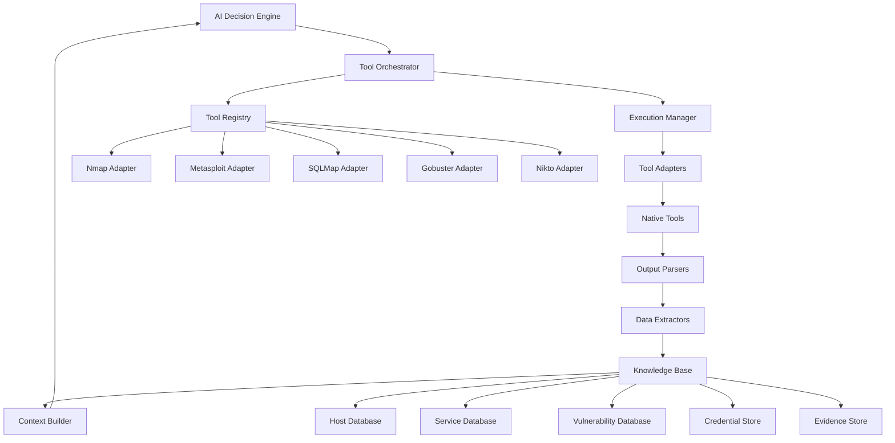
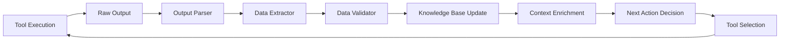

# Nexus Tool Integration and Data Flow System

## Overview
The tool integration system is responsible for orchestrating the execution of penetration testing tools, parsing their outputs, and intelligently chaining tools together based on discovered information. This system enables Nexus to automatically use nmap results for Metasploit targeting, SQLMap parameter discovery from web crawling, and other sophisticated tool combinations.

## Core Integration Architecture

### Tool Integration Framework



### Data Flow Pipeline



## Tool Adapter System

### Base Tool Adapter

```python
from abc import ABC, abstractmethod
from typing import Dict, List, Any, Optional
import subprocess
import json
import re
from dataclasses import dataclass
from enum import Enum

class ToolStatus(Enum):
    SUCCESS = "success"
    FAILED = "failed"
    TIMEOUT = "timeout"
    ERROR = "error"

@dataclass
class ToolResult:
    tool_name: str
    command: str
    status: ToolStatus
    raw_output: str
    parsed_data: Dict[str, Any]
    execution_time: float
    error_message: Optional[str] = None

class BaseToolAdapter(ABC):
    def __init__(self, tool_path: str, default_args: List[str] = None):
        self.tool_path = tool_path
        self.default_args = default_args or []
        self.timeout = 300  # 5 minutes default
    
    @abstractmethod
    def build_command(self, target: str, **kwargs) -> List[str]:
        """Build the command to execute"""
        pass
    
    @abstractmethod
    def parse_output(self, raw_output: str) -> Dict[str, Any]:
        """Parse tool output into structured data"""
        pass
    
    def execute(self, target: str, **kwargs) -> ToolResult:
        """Execute the tool and return parsed results"""
        start_time = time.time()
        command = self.build_command(target, **kwargs)
        
        try:
            result = subprocess.run(
                command,
                capture_output=True,
                text=True,
                timeout=self.timeout
            )
            
            execution_time = time.time() - start_time
            
            if result.returncode == 0:
                parsed_data = self.parse_output(result.stdout)
                return ToolResult(
                    tool_name=self.__class__.__name__,
                    command=" ".join(command),
                    status=ToolStatus.SUCCESS,
                    raw_output=result.stdout,
                    parsed_data=parsed_data,
                    execution_time=execution_time
                )
            else:
                return ToolResult(
                    tool_name=self.__class__.__name__,
                    command=" ".join(command),
                    status=ToolStatus.FAILED,
                    raw_output=result.stderr,
                    parsed_data={},
                    execution_time=execution_time,
                    error_message=result.stderr
                )
                
        except subprocess.TimeoutExpired:
            return ToolResult(
                tool_name=self.__class__.__name__,
                command=" ".join(command),
                status=ToolStatus.TIMEOUT,
                raw_output="",
                parsed_data={},
                execution_time=self.timeout,
                error_message="Command timed out"
            )
        except Exception as e:
            return ToolResult(
                tool_name=self.__class__.__name__,
                command=" ".join(command),
                status=ToolStatus.ERROR,
                raw_output="",
                parsed_data={},
                execution_time=time.time() - start_time,
                error_message=str(e)
            )
```

### Specific Tool Adapters

#### Nmap Adapter

```python
class NmapAdapter(BaseToolAdapter):
    def __init__(self, tool_path: str = "/usr/bin/nmap"):
        super().__init__(tool_path, ["-sS", "-sV", "-O"])
        self.timeout = 600  # 10 minutes for comprehensive scans
    
    def build_command(self, target: str, **kwargs) -> List[str]:
        command = [self.tool_path]
        
        # Scan type
        scan_type = kwargs.get("scan_type", "syn")
        if scan_type == "syn":
            command.append("-sS")
        elif scan_type == "tcp":
            command.append("-sT")
        elif scan_type == "udp":
            command.append("-sU")
        
        # Service detection
        if kwargs.get("service_detection", True):
            command.append("-sV")
        
        # OS detection
        if kwargs.get("os_detection", True):
            command.append("-O")
        
        # Script scanning
        scripts = kwargs.get("scripts", [])
        if scripts:
            command.extend(["--script", ",".join(scripts)])
        
        # Timing template
        timing = kwargs.get("timing", 3)
        command.extend(["-T", str(timing)])
        
        # Port specification
        ports = kwargs.get("ports", "1-65535")
        command.extend(["-p", ports])
        
        # Output format
        command.extend(["-oX", "-"])  # XML output to stdout
        
        # Target
        command.append(target)
        
        return command
    
    def parse_output(self, raw_output: str) -> Dict[str, Any]:
        """Parse Nmap XML output"""
        try:
            import xml.etree.ElementTree as ET
            root = ET.fromstring(raw_output)
            
            hosts = []
            for host in root.findall("host"):
                host_data = {
                    "ip": None,
                    "hostname": None,
                    "status": None,
                    "os": None,
                    "ports": []
                }
                
                # IP address
                address = host.find("address[@addrtype='ipv4']")
                if address is not None:
                    host_data["ip"] = address.get("addr")
                
                # Hostname
                hostname = host.find("hostnames/hostname[@type='PTR']")
                if hostname is not None:
                    host_data["hostname"] = hostname.get("name")
                
                # Status
                status = host.find("status")
                if status is not None:
                    host_data["status"] = status.get("state")
                
                # OS detection
                os_match = host.find("os/osmatch")
                if os_match is not None:
                    host_data["os"] = {
                        "name": os_match.get("name"),
                        "accuracy": os_match.get("accuracy")
                    }
                
                # Ports
                for port in host.findall("ports/port"):
                    port_data = {
                        "port": int(port.get("portid")),
                        "protocol": port.get("protocol"),
                        "state": port.find("state").get("state"),
                        "service": None,
                        "version": None
                    }
                    
                    service = port.find("service")
                    if service is not None:
                        port_data["service"] = service.get("name")
                        port_data["version"] = service.get("version")
                        port_data["product"] = service.get("product")
                    
                    host_data["ports"].append(port_data)
                
                hosts.append(host_data)
            
            return {"hosts": hosts}
            
        except Exception as e:
            # Fallback to regex parsing
            return self.parse_output_regex(raw_output)
    
    def parse_output_regex(self, raw_output: str) -> Dict[str, Any]:
        """Fallback regex parsing for Nmap output"""
        hosts = []
        current_host = None
        
        for line in raw_output.split('\n'):
            # Host detection
            host_match = re.search(r'Nmap scan report for (.+)', line)
            if host_match:
                if current_host:
                    hosts.append(current_host)
                current_host = {
                    "ip": host_match.group(1),
                    "ports": []
                }
            
            # Port detection
            port_match = re.search(r'(\d+)/(tcp|udp)\s+(\w+)\s+(.+)', line)
            if port_match and current_host:
                port_data = {
                    "port": int(port_match.group(1)),
                    "protocol": port_match.group(2),
                    "state": port_match.group(3),
                    "service": port_match.group(4)
                }
                current_host["ports"].append(port_data)
        
        if current_host:
            hosts.append(current_host)
        
        return {"hosts": hosts}
```

#### Metasploit Adapter

```python
class MetasploitAdapter(BaseToolAdapter):
    def __init__(self, msf_path: str = "/usr/share/metasploit-framework"):
        super().__init__(msf_path)
        self.msfconsole = f"{msf_path}/msfconsole"
        self.timeout = 900  # 15 minutes for exploitation
    
    def build_command(self, target: str, **kwargs) -> List[str]:
        exploit = kwargs.get("exploit")
        payload = kwargs.get("payload")
        options = kwargs.get("options", {})
        
        # Build MSF resource script
        script_lines = [
            f"use {exploit}",
            f"set RHOSTS {target}"
        ]
        
        # Set payload if specified
        if payload:
            script_lines.append(f"set PAYLOAD {payload}")
        
        # Set additional options
        for key, value in options.items():
            script_lines.append(f"set {key} {value}")
        
        # Add exploit command
        script_lines.extend([
            "check",
            "exploit -z",
            "exit"
        ])
        
        # Write to temporary file
        import tempfile
        with tempfile.NamedTemporaryFile(mode='w', suffix='.rc', delete=False) as f:
            f.write('\n'.join(script_lines))
            script_file = f.name
        
        return [self.msfconsole, "-q", "-r", script_file]
    
    def parse_output(self, raw_output: str) -> Dict[str, Any]:
        """Parse Metasploit output"""
        result = {
            "exploit_success": False,
            "sessions": [],
            "vulnerabilities": [],
            "errors": []
        }
        
        # Check for successful exploitation
        if "Meterpreter session" in raw_output or "Command shell session" in raw_output:
            result["exploit_success"] = True
            
            # Extract session information
            session_matches = re.findall(r'(Meterpreter|Command shell) session (\d+) opened', raw_output)
            for session_type, session_id in session_matches:
                result["sessions"].append({
                    "id": int(session_id),
                    "type": session_type.lower()
                })
        
        # Check for vulnerability confirmation
        if "The target appears to be vulnerable" in raw_output:
            result["vulnerabilities"].append("Target confirmed vulnerable")
        
        # Extract errors
        error_patterns = [
            r'Exploit failed: (.+)',
            r'Error: (.+)',
            r'Exception: (.+)'
        ]
        
        for pattern in error_patterns:
            errors = re.findall(pattern, raw_output)
            result["errors"].extend(errors)
        
        return result
```

#### SQLMap Adapter

```python
class SQLMapAdapter(BaseToolAdapter):
    def __init__(self, tool_path: str = "/usr/bin/sqlmap"):
        super().__init__(tool_path)
        self.timeout = 1800  # 30 minutes for comprehensive SQL injection testing
    
    def build_command(self, target: str, **kwargs) -> List[str]:
        command = [self.tool_path]
        
        # Target URL or request file
        if target.startswith("http"):
            command.extend(["-u", target])
        else:
            command.extend(["-r", target])  # Request file
        
        # Parameters to test
        params = kwargs.get("parameters", [])
        if params:
            command.extend(["-p", ",".join(params)])
        
        # Database management system
        dbms = kwargs.get("dbms")
        if dbms:
            command.extend(["--dbms", dbms])
        
        # Risk and level
        risk = kwargs.get("risk", 1)
        level = kwargs.get("level", 1)
        command.extend(["--risk", str(risk), "--level", str(level)])
        
        # Techniques
        technique = kwargs.get("technique", "BEUSTQ")
        command.extend(["--technique", technique])
        
        # Output options
        command.extend(["--batch", "--no-cast"])
        
        # Data extraction options
        if kwargs.get("dump_all", False):
            command.append("--dump-all")
        elif kwargs.get("dump_tables"):
            command.extend(["-T", kwargs["dump_tables"], "--dump"])
        
        # Enumeration options
        if kwargs.get("enumerate_dbs", False):
            command.append("--dbs")
        if kwargs.get("enumerate_tables", False):
            command.append("--tables")
        if kwargs.get("enumerate_columns", False):
            command.append("--columns")
        
        return command
    
    def parse_output(self, raw_output: str) -> Dict[str, Any]:
        """Parse SQLMap output"""
        result = {
            "vulnerable": False,
            "injection_points": [],
            "databases": [],
            "tables": [],
            "data": {},
            "errors": []
        }
        
        # Check for SQL injection vulnerability
        if "sqlmap identified the following injection point" in raw_output:
            result["vulnerable"] = True
            
            # Extract injection points
            injection_matches = re.findall(
                r'Parameter: (.+?) \((.+?)\).*?Type: (.+?).*?Title: (.+?).*?Payload: (.+?)(?=\n\n|\nParameter:|\Z)',
                raw_output,
                re.DOTALL
            )
            
            for match in injection_matches:
                result["injection_points"].append({
                    "parameter": match[0],
                    "location": match[1],
                    "type": match[2],
                    "title": match[3],
                    "payload": match[4].strip()
                })
        
        # Extract databases
        db_matches = re.findall(r'available databases \[(\d+)\]:(.*?)(?=\n\n|\navailable|\Z)', raw_output, re.DOTALL)
        for count, db_list in db_matches:
            databases = [db.strip('* ') for db in db_list.split('\n') if db.strip()]
            result["databases"] = databases
        
        # Extract tables
        table_matches = re.findall(r'Database: (.+?)\n\[(\d+) tables?\]:(.*?)(?=\n\n|Database:|\Z)', raw_output, re.DOTALL)
        for db_name, count, table_list in table_matches:
            tables = [table.strip('* ') for table in table_list.split('\n') if table.strip()]
            result["tables"].extend([{"database": db_name, "table": table} for table in tables])
        
        return result
```

### Tool Chain Orchestrator

```python
class ToolChainOrchestrator:
    def __init__(self, knowledge_base):
        self.knowledge_base = knowledge_base
        self.tool_registry = {}
        self.execution_history = []
        
        # Register tool adapters
        self.register_tools()
    
    def register_tools(self):
        """Register all available tool adapters"""
        self.tool_registry = {
            "nmap": NmapAdapter(),
            "metasploit": MetasploitAdapter(),
            "sqlmap": SQLMapAdapter(),
            "gobuster": GobusterAdapter(),
            "nikto": NiktoAdapter(),
            "hydra": HydraAdapter(),
            "john": JohnAdapter()
        }
    
    def execute_tool_chain(self, chain_config: Dict[str, Any]) -> List[ToolResult]:
        """Execute a chain of tools based on configuration"""
        results = []
        context = chain_config.get("context", {})
        
        for step in chain_config["steps"]:
            tool_name = step["tool"]
            target = step.get("target", context.get("primary_target"))
            
            # Build tool parameters from context and step config
            tool_params = self.build_tool_params(step, context, results)
            
            # Execute tool
            if tool_name in self.tool_registry:
                adapter = self.tool_registry[tool_name]
                result = adapter.execute(target, **tool_params)
                results.append(result)
                
                # Update context with results
                context = self.update_context(context, result)
                
                # Update knowledge base
                self.knowledge_base.update_from_tool_result(result)
                
                # Log execution
                self.execution_history.append({
                    "tool": tool_name,
                    "target": target,
                    "params": tool_params,
                    "result": result,
                    "timestamp": datetime.now().isoformat()
                })
            else:
                raise ValueError(f"Unknown tool: {tool_name}")
        
        return results
    
    def build_tool_params(self, step_config: Dict, context: Dict, previous_results: List[ToolResult]) -> Dict:
        """Build tool parameters from context and previous results"""
        params = step_config.get("params", {}).copy()
        
        # Apply context substitutions
        for key, value in params.items():
            if isinstance(value, str) and value.startswith("${"):
                # Extract context variable
                var_name = value[2:-1]  # Remove ${ and }
                if var_name in context:
                    params[key] = context[var_name]
        
        # Apply result-based parameters
        result_mappings = step_config.get("result_mappings", {})
        for param_name, mapping in result_mappings.items():
            source_tool = mapping.get("source_tool")
            source_field = mapping.get("source_field")
            
            # Find result from specified tool
            for result in previous_results:
                if result.tool_name.lower() == source_tool.lower():
                    if source_field in result.parsed_data:
                        params[param_name] = result.parsed_data[source_field]
                    break
        
        return params
    
    def update_context(self, context: Dict, result: ToolResult) -> Dict:
        """Update context with tool result data"""
        updated_context = context.copy()
        
        # Tool-specific context updates
        if result.tool_name == "NmapAdapter":
            hosts = result.parsed_data.get("hosts", [])
            updated_context["discovered_hosts"] = [h["ip"] for h in hosts if h.get("ip")]
            updated_context["open_ports"] = []
            
            for host in hosts:
                for port in host.get("ports", []):
                    if port["state"] == "open":
                        updated_context["open_ports"].append({
                            "host": host["ip"],
                            "port": port["port"],
                            "service": port.get("service"),
                            "version": port.get("version")
                        })
        
        elif result.tool_name == "SQLMapAdapter":
            if result.parsed_data.get("vulnerable"):
                updated_context["sql_injection_found"] = True
                updated_context["injection_points"] = result.parsed_data.get("injection_points", [])
        
        return updated_context
```

### Intelligent Tool Selection

```python
class IntelligentToolSelector:
    def __init__(self, knowledge_base):
        self.knowledge_base = knowledge_base
        self.tool_effectiveness = {}
        self.load_tool_effectiveness_data()
    
    def load_tool_effectiveness_data(self):
        """Load historical tool effectiveness data"""
        self.tool_effectiveness = {
            "web_apps": {
                "nikto": 0.8,
                "sqlmap": 0.9,
                "gobuster": 0.85,
                "burpsuite": 0.95
            },
            "network_services": {
                "nmap": 0.95,
                "metasploit": 0.7,
                "hydra": 0.6
            },
            "windows_systems": {
                "metasploit": 0.8,
                "crackmapexec": 0.85,
                "impacket": 0.9
            },
            "linux_systems": {
                "metasploit": 0.75,
                "linpeas": 0.9,
                "john": 0.7
            }
        }
    
    def select_optimal_tools(self, target_type: str, objective: str, context: Dict) -> List[str]:
        """Select optimal tools based on target type and objective"""
        available_tools = self.tool_effectiveness.get(target_type, {})
        
        # Filter tools based on objective
        objective_filters = {
            "reconnaissance": ["nmap", "gobuster", "nikto"],
            "exploitation": ["metasploit", "sqlmap", "hydra"],
            "post_exploitation": ["linpeas", "winpeas", "bloodhound"],
            "persistence": ["metasploit", "empire", "covenant"]
        }
        
        relevant_tools = objective_filters.get(objective, list(available_tools.keys()))
        
        # Score tools based on effectiveness and context
        tool_scores = {}
        for tool in relevant_tools:
            if tool in available_tools:
                base_score = available_tools[tool]
                context_bonus = self.calculate_context_bonus(tool, context)
                tool_scores[tool] = base_score + context_bonus
        
        # Return tools sorted by score
        return sorted(tool_scores.keys(), key=lambda x: tool_scores[x], reverse=True)
    
    def calculate_context_bonus(self, tool: str, context: Dict) -> float:
        """Calculate context-based bonus for tool selection"""
        bonus = 0.0
        
        # Service-specific bonuses
        if tool == "sqlmap" and any("http" in str(port) for port in context.get("open_ports", [])):
            bonus += 0.1
        
        if tool == "metasploit" and context.get("confirmed_vulnerabilities"):
            bonus += 0.15
        
        if tool == "hydra" and any("ssh" in str(service) or "ftp" in str(service) 
                                  for service in context.get("services", [])):
            bonus += 0.1
        
        return bonus
```

### Data Flow Management

```python
class DataFlowManager:
    def __init__(self):
        self.data_transformers = {}
        self.register_transformers()
    
    def register_transformers(self):
        """Register data transformers for tool chaining"""
        self.data_transformers = {
            "nmap_to_metasploit": self.transform_nmap_to_metasploit,
            "gobuster_to_sqlmap": self.transform_gobuster_to_sqlmap,
            "nmap_to_hydra": self.transform_nmap_to_hydra,
            "sqlmap_to_metasploit": self.transform_sqlmap_to_metasploit
        }
    
    def transform_nmap_to_metasploit(self, nmap_result: ToolResult) -> Dict[str, Any]:
        """Transform Nmap results for Metasploit targeting"""
        targets = []
        
        for host in nmap_result.parsed_data.get("hosts", []):
            for port in host.get("ports", []):
                if port["state"] == "open" and port.get("service"):
                    service = port["service"].lower()
                    version = port.get("version", "")
                    
                    # Map services to potential exploits
                    exploit_mappings = {
                        "ssh": ["auxiliary/scanner/ssh/ssh_version", "exploit/linux/ssh/"],
                        "ftp": ["auxiliary/scanner/ftp/ftp_version", "exploit/unix/ftp/"],
                        "http": ["auxiliary/scanner/http/", "exploit/multi/http/"],
                        "https": ["auxiliary/scanner/http/", "exploit/multi/http/"],
                        "smb": ["auxiliary/scanner/smb/", "exploit/windows/smb/"],
                        "mysql": ["auxiliary/scanner/mysql/", "exploit/linux/mysql/"],
                        "postgresql": ["auxiliary/scanner/postgres/", "exploit/linux/postgres/"]
                    }
                    
                    if service in exploit_mappings:
                        targets.append({
                            "host": host["ip"],
                            "port": port["port"],
                            "service": service,
                            "version": version,
                            "potential_exploits": exploit_mappings[service]
                        })
        
        return {"metasploit_targets": targets}
    
    def transform_gobuster_to_sqlmap(self, gobuster_result: ToolResult) -> Dict[str, Any]:
        """Transform Gobuster results for SQLMap testing"""
        sql_targets = []
        
        # Extract discovered URLs with potential SQL injection points
        discovered_paths = gobuster_result.parsed_data.get("discovered_paths", [])
        
        for path in discovered_paths:
            if any(indicator in path.lower() for indicator in 
                   ["login", "search", "id=", "user=", "admin", "query"]):
                sql_targets.append({
                    "url": path,
                    "method": "GET",
                    "parameters": self.extract_parameters(path)
                })
        
        return {"sqlmap_targets": sql_targets}
    
    def extract_parameters(self, url: str) -> List[str]:
        """Extract potential parameters from URL"""
        import urllib.parse
        parsed = urllib.parse.urlparse(url)
        params = urllib.parse.parse_qs(parsed.query)
        return list(params.keys())
    
    def apply_transformation(self, source_tool: str, target_tool: str, result: ToolResult) -> Dict[str, Any]:
        """Apply data transformation between tools"""
        transformer_key = f"{source_tool}_to_{target_tool}"
        
        if transformer_key in self.data_transformers:
            return self.data_transformers[transformer_key](result)
        else:
            return {}
```

This comprehensive tool integration system enables Nexus to intelligently chain penetration testing tools, automatically use outputs from one tool as inputs to another, and maintain a rich knowledge base of discovered information throughout the assessment process.